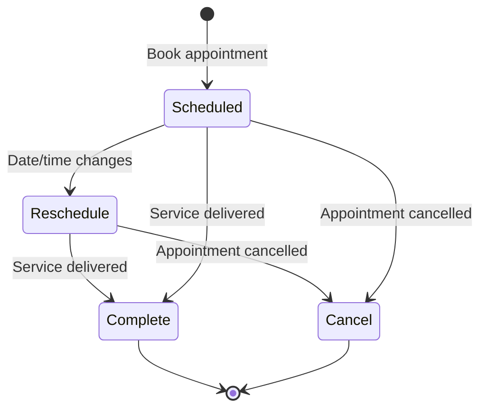
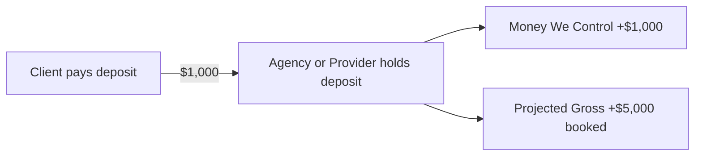
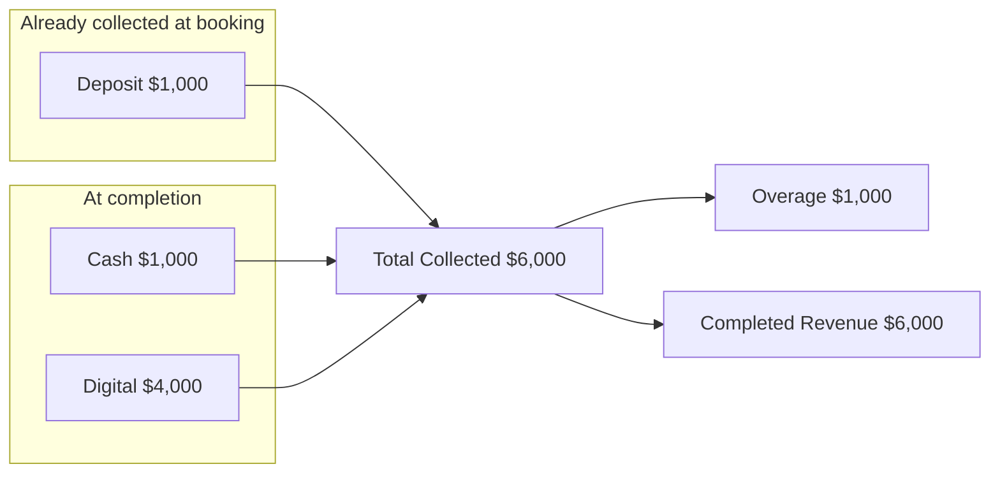
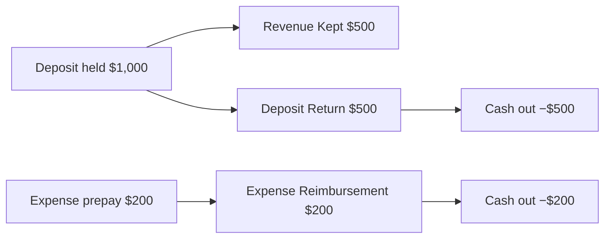
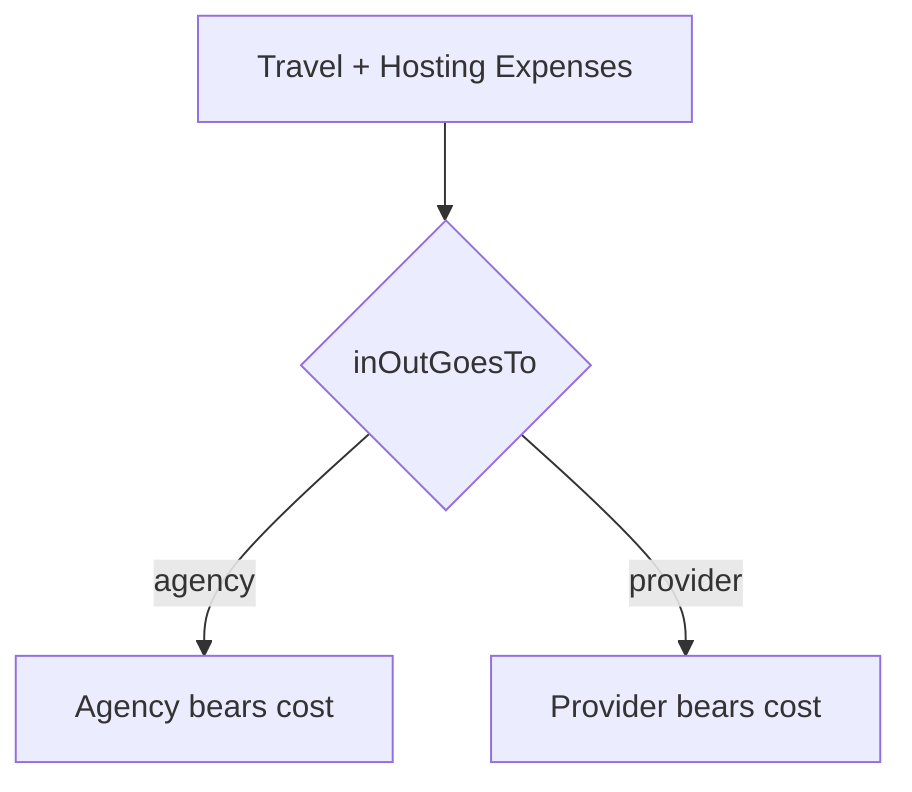

# Appointment Lifecycle — Money Flow

**Session 2 deliverable**  
Companion to [metric-dictionary.md](./metric-dictionary.md)

This document shows how money moves at each stage of an appointment's life. Use it to verify UI labels, API calculations, and dashboard rollups.

---

## Status overview



| Status | Meaning |
|--------|---------|
| **Scheduled** | Booked, not yet occurred |
| **Reschedule** | Date/time updated, still expected to occur |
| **Complete** | Service delivered, final payment recorded |
| **Cancel** | Appointment will not occur |

---

## Lifecycle 1 — Booking (Scheduled)

**User enters:** projected revenue, deposit, travel/hosting expenses, inOutGoesTo, deposit received by.

**Example:** $5,000 projected, $1,000 deposit.



| Metric | Value | Dashboard effect |
|--------|-------|------------------|
| Projected Revenue | $5,000 | +$5,000 Projected Gross |
| Deposit Amount | $1,000 | +$1,000 Money We Control |
| Due to Provider Upon Arrival | $4,000 | Informational — balance client owes at arrival |
| Overage | $0 | Not applicable yet |
| Completed Revenue | $0 | Not complete |
| Unearned portion | $4,000 | $5,000 quoted − $1,000 collected |

**Formulas at booking:**

```
dueToProviderUponArrival = projectedRevenue − depositAmount   → $4,000
totalExpenses            = travelExpense + hostingExpense
moneyWeControl          += depositAmount                       → +$1,000
projectedGross          += projectedRevenue                      → +$5,000
```

---

## Lifecycle 2 — Reschedule

**User enters:** updated date/time (optional updated deposit if changed).

**Money impact:** No automatic change unless deposit or projected revenue is edited.

| Scenario | Money We Control | Projected Gross |
|----------|------------------|-----------------|
| Date only changes | Unchanged | Unchanged |
| Deposit increased by $200 | +$200 | Unchanged (unless projected also changes) |
| Projected increased to $5,500 | +$0 (until more collected) | +$500 |

If rescheduled multiple times, track `rescheduleOccurrences` for confidence scoring only — no direct financial formula today.

---

## Lifecycle 3 — Complete

**User enters:** cash collected, digital collected at disposition.

**Example:** Cash $1,000, Digital $4,000 (on top of $1,000 deposit).



| Metric | Value |
|--------|-------|
| Total Collected | $6,000 |
| Overage Amount | $1,000 (`$6,000 − $5,000 projected`) |
| Completed Revenue | $6,000 |
| Money We Control | Counts full $6,000 for this appointment |

**Formulas at complete:**

```
totalCollected      = depositAmount + totalCollectedCash + totalCollectedDigital
overageAmount       = max(0, totalCollected − projectedRevenue)
underpaymentAmount  = max(0, projectedRevenue − totalCollected)
isUnderpayment      = underpaymentAmount > 0   → show UI warning badge
completedRevenue    = totalCollected
```

Overage and underpayment are mutually exclusive.

**Due Upon Arrival check (informational):**

```
cash + digital at completion = $5,000
dueUponArrival             = $4,000
excess at arrival            = $1,000  → flows into overageAmount
```

---

## Lifecycle 4 — Cancel

**User enters:** who canceled, cancellation details, deposit return amount, expense reimbursement amount.

**Example:** $1,000 deposit, $500 service deposit returned, $200 airfare reimbursed.



| Metric | Value |
|--------|-------|
| Deposit Amount | $1,000 |
| Deposit Return Amount | $500 (service portion) |
| Expense Reimbursement Amount | $200 (travel/hosting) |
| Cancel Revenue Kept | $500 |
| Total returned to client | $700 |
| Money We Control (net for this apt) | $300 (`$1,000 − $500 − $200`) |

**Formulas at cancel:**

```
cancelRevenueKept        = depositAmount − depositReturnAmount
totalCashReturnedToClient = depositReturnAmount + expenseReimbursementAmount
moneyWeControl           = depositAmount − depositReturnAmount
                           (expense reimbursement reduces cash separately)
```

**Projected Gross:** Cancelled appointments still count in projected gross if using all-appointments sum. Consider filtering cancelled from pipeline views in UI (product decision).

---

## State → Formula quick reference

| Status | totalCollected | overageAmount | completedRevenue | cancelRevenueKept | moneyWeControl contribution |
|--------|----------------|---------------|------------------|-------------------|----------------------------|
| Scheduled | — | 0 | 0 | — | depositAmount |
| Reschedule | — | 0 | 0 | — | depositAmount |
| Complete | dep + cash + digital | max(0, TC − projected) | totalCollected | — | totalCollected |
| Cancel | — | 0 | 0 | dep − depReturn | dep − depReturn |

---

## Expense responsibility (`inOutGoesTo`)

Travel and hosting expenses are tracked per appointment. `inOutGoesTo` records **who pays** — agency or provider — not how much the provider earns.



| Field | Affects Due Upon Arrival? | Affects Money We Control? | Affects Projected Gross? |
|-------|---------------------------|---------------------------|--------------------------|
| travelExpense | No | Only when actually paid/reimbursed | No |
| hostingExpense | No | Only when actually paid/reimbursed | No |
| inOutGoesTo | No | Indirect (who pays out) | No |
| depositReceivedBy | No | Informational | No |

**Future work:** Expense reports by `inOutGoesTo` and agency-provider compensation agreements (`provider_compensation` table) are not yet tied to per-appointment math.

---

## Golden appointment scenarios (Session 3 checklist)

Use these scenarios to reconcile app numbers against this document. Pick real appointments from production that match each row.

| # | Scenario | Projected | Deposit | Complete cash/digital | Cancel returns | Expected overage | Expected MWC contribution |
|---|----------|-----------|---------|----------------------|----------------|------------------|---------------------------|
| 1 | Simple complete, exact pay | $500 | $100 | $400 cash | — | $0 | $500 |
| 2 | Complete with overage | $5,000 | $1,000 | $1k cash + $4k digital | — | $1,000 | $6,000 |
| 3 | Scheduled only | $5,000 | $1,000 | — | — | $0 | $1,000 |
| 4 | Cancel, keep full deposit | $500 | $100 | — | $0 return | $0 | $100 |
| 5 | Cancel, full deposit return | $500 | $100 | — | $100 dep return | $0 | $0 |
| 6 | Cancel, partial dep + expense reimb | $1,000 | $1,000 | — | $500 dep + $200 expense | $0 | $500 |
| 7 | Reschedule, no money change | $3,000 | $500 | — | — | $0 | $500 |
| 8 | Zero deposit complete | $400 | $0 | $400 cash | — | $0 | $400 |
| 9 | Deposit only, no completion payment | $500 | $500 | $0 / $0 | — | $0 | $500 |
| 10 | Complete under projected (underpay) | $500 | $100 | $300 cash | — | $0 underpay $100 | $400 |

**Underpayment (confirmed):** Flag in UI when `totalCollected < projectedRevenue` on complete appointments. Live example: **ID 175** — projected $5,000, collected $2,000, underpayment $3,000.

---

## Session 3 complete

See [golden-appointment-workbook.md](./golden-appointment-workbook.md) — 15 sampled appointments from 121 live records. **48% have field mismatches**, primarily `total_collected` dropping deposits on update.

## Session 4 — complete

See `shared/appointmentFinancials.ts`, `npm run db:backfill-financials`, dashboard cards, and `CollectionStatusBadge`.